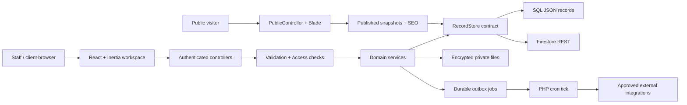

<!-- Author: ramanpal singh | URL: https://kwebby.com -->

# LawyerCMS architecture and extension guide

LawyerCMS is a single-firm Laravel modular monolith. One installation can serve multiple offices, staff members and explicitly authorized clients. React/Inertia powers the authenticated workspace; Blade renders public pages and metadata into initial HTML. Business logic lives in PHP services and uses a portable record-store contract.

This document describes the code that is present. It is not a claim that every database/provider/operating-system combination has completed production certification. See [release gates](RELEASE_GATES.md) for evidence and outstanding checks, [deployment](DEPLOYMENT.md) for setup, and [the theme tutorial](THEME_TUTORIAL.md) for public design customization.

## Request and work flow



The baseline runs through PHP-FPM/Apache plus PHP CLI cron, with filesystem sessions/cache. It needs no production Node process, Docker, Redis, Chromium or permanent worker. Node and npm are used to build frontend assets; packaged releases include their output. mPDF and PHPWord handle document export. Installed versions and lockfiles, not floating upstream versions, determine the actual build.

## Source map

| Path | Responsibility |
| --- | --- |
| `app/Contracts/RecordStore.php` | Portable JSON record operations and transaction/maintenance snapshot contract. |
| `app/Infrastructure/` | SQL and Firestore adapters plus bounded backup/import record validation. |
| `app/Auth/` | `CrmUser` identity and custom Laravel authentication provider. |
| `app/Domain/Operations/` | CRM, contacts, matters, proceedings and tasks. |
| `app/Domain/Finance/` | Billing work, invoice issuance, payment adapters, payroll and immutable financial documents. |
| `app/Domain/Communications/` | Notification delivery preferences, messages/digests and email scheduling. |
| `app/Domain/Publishing/` | BlockNote validation/export, content revisions, themes, website snapshots, fonts/media, SEO and IndexNow. |
| `app/Support/` | Object access, audit, jobs/outbox, settings/secrets, private storage, scanner, endpoint policy, AI, health and backup. |
| `app/Http/Controllers/` | Versioned HTTP endpoints, auth/workspace, module actions and public rendering. |
| `app/Http/Middleware/` | Secure workspace, Inertia props and recent-authentication checks. |
| `app/Console/Commands/` | Installer, demo fixture, cron tick and backup commands. |
| `config/permissions.php` | Built-in role/action scopes; custom role records can supply rules. |
| `config/crm.php` | Store/profile, private path, approved hosts, scanner, AI budget and release version. |
| `routes/web.php` | Auth and workspace routes; includes module route files. |
| `routes/business.php` | Operations, finance and employee API actions. |
| `routes/publishing.php` | Content, theme, SEO, public pages and contact requests. |
| `routes/website.php`, `routes/website-assets.php` | Website snapshot, media and font APIs. |
| `routes/analyzers.php` | Public lead-tool routes and verification/result flow. |
| `resources/js/Pages/` | Inertia entry pages. |
| `resources/js/Components/` | Workspace module interfaces, BlockNote editor and Website settings. |
| `resources/js/lib/`, `resources/css/` | Client contracts/helpers and styles. |
| `resources/views/public/` | Trusted server-side page, website, section, office and metadata renderers. |
| `resources/themes/` | Supplied immutable designs, split-layout starter and importable theme archives. |
| `public/fonts/website/` | Bundled local font files, catalog and license/source records. |
| `tests/Feature/`, `tests/Unit/` | Module, permission, concurrency, adapter and security behavior checks. |
| `deploy/`, `bin/`, `docs/` | Hosting templates, release/build tools and operator/developer documentation. |

Internal command/environment names such as `crm:tick`, `CRM_STORE` and the existing `builtin-counsel` theme ID are compatibility interfaces. The user-facing product is LawyerCMS; changing those identifiers without a migration can break installed systems or retained snapshots.

## Database portability

`AppServiceProvider` binds `RecordStore` to `SqlRecordStore` when `CRM_STORE=sql`, or to `FirestoreRecordStore` for `firestore`.

SQL uses one `crm_records` table, keyed by collection and ID, with JSON payloads and version/timestamp columns. It is not a conventional Eloquent table/model for each business entity. MySQL and PostgreSQL share the SQL adapter; Supabase is a PostgreSQL connection profile. Firestore stores corresponding collections/documents through official REST requests and service-account authentication. It requires no PHP gRPC extension. Browser code receives no service-account credential.

Every record returned by the store contains `id`, integer `version`, `created_at` and `updated_at`. The contract provides:

| Method | Meaning |
| --- | --- |
| `get(collection, id)` | Get one record or null. |
| `query(collection, filters, limit, orderBy, direction)` | Exact-equality filters with bounded results and ordering. This is not a full-text search engine. |
| `each(collection, filters, pageSize)` | Every matching record, newest first, read in bounded pages. Use it for listings, searches and checks (such as conflict review) that must not stop at a limit. Not for use inside `transaction()`. |
| `create(collection, data, id?)` | Insert a record; assign UUID unless a stable ID is supplied. |
| `put(collection, id, data, expectedVersion?)` | Replace application fields, preserve creation time, advance version and optionally reject stale writes. |
| `delete(collection, id, expectedVersion?)` | Delete, with optional conflict checking. |
| `transaction(callback)` | Group primary-store reads/writes atomically; callbacks can be retried. |
| `scan(cursor, limit)` / `restore(batch)` | Maintenance-only bounded snapshots preserving IDs, versions and timestamps. |

SQL locks transaction reads and checks versions on updates. Firestore buffers writes and commits them in a transaction. Stable IDs enforce idempotency for operations such as jobs and financial effects. `Conflict` produces HTTP 409; validation produces 422; unauthorized objects/actions produce 403.

Business services own financial and workflow invariants. The store alone does not enforce invoice numbering, account permissions or client-file visibility. Do not bypass services by inserting arbitrary records from a UI. Database records are JSON, while large document bodies and binary assets use the private-file service.

Firestore production queries may require composite indexes; they are installation concerns. Real Supabase/Firestore credentials and managed-service contract tests remain separate release gates. SQLite is a convenient local/fast-test harness, not one of the promised production certification profiles. Switching profiles requires an explicit maintenance export/import/validation/rollback process; it is not a live toggle.

## Identity and authorization

Laravel authenticates `CrmUser` through `CrmUserProvider`; application identities do not depend on an Eloquent user model. Invitations, prospects, verified email, MFA, password recovery and recent authentication are application workflows.

`Access::authorize($user, 'domain.action', $record)` enforces object access. Roles map action names to scopes such as firm or assigned/team access. Record fields including `owner_id`, `team_ids`, `member_ids`, `client_ids`, `denied_user_ids` and `confidentiality` participate in the decision. Restricted matters require assignment even for broad roles. Matter-related records also check access to the parent matter. Conversation/message access checks membership. Employees can read their own payslips; payroll management remains separately authorized.

A payer, prospect or contact is not automatically a client with legal-file access. Client/prospect users only see explicitly shared records in permitted domains; business services grant or release information deliberately.

New endpoints must check authentication and the action **and** object scope. Apply the same checks to downloads, search results, export sources, job execution and AI sources. Returning a menu capability or filtering a browser table is not an authorization boundary. `fresh` middleware is required for the existing sensitive actions such as publishing, credential changes and exports; follow the applicable module pattern.

## Files, scanning and external destinations

`PrivateFiles` writes encrypted opaque category/UUID files under `CRM_PRIVATE_PATH`, which belongs outside the webroot. Laravel encryption uses the installation's application key. Back up that key securely with the encrypted data: losing it makes the contents unrecoverable. File references are validated and public responses omit private paths.

Uploads enter quarantine. `UploadScanner` sends bounded requests to an operator-approved HTTPS scanner, requires a matching SHA-256 digest and a `clean` or `infected` verdict, and fails closed when unavailable. A scanner endpoint is not supplied by the application. Previews, exports, AI processing and downloads must respect the relevant scan status.

`EndpointPolicy` approves destinations, rejects credentials/private/reserved addresses and pins resolved hosts per request; it does not accept an arbitrary URL merely because an administrator typed it. SMTP similarly requires an approved host and supported TLS port. Font installation has its own fixed official-domain fetch/validation policy.

Website media, theme assets and private matter attachments have different publication rules:

- Matter files require current object access and scan checks.
- Ready Website media is publicly served only while referenced by the current visible published website; retained references block deletion for rollback.
- Validated imported theme assets are public design resources by ID and should never contain confidential material.
- Temporary analyzer uploads/results expire and are excluded from backup snapshots.

## Jobs, audit and idempotency

`Outbox::enqueue()` writes durable `jobs` records in the primary store. A supplied deduplication key creates a stable job ID. Business changes and their queued event should be committed together. The cron command `crm:tick --budget=45` processes bounded work without a permanently running worker.

`JobRunner` claims a three-minute lease, records attempts/token/expiry, retries recoverable failures with backoff and marks a job failed after its fifth attempt. An expired running lease is reclaimed as the next attempt; when the attempt that expired was the fifth, the job is marked failed (`last_error` `LeaseExpired`) with the same side effects as any terminal failure (the AI run is failed and owners/admins are notified) instead of running again, so a job that crashes PHP (fatal error, memory exhaustion, kill) cannot be retried forever. Each handler runs under a 120-second CPU-time limit and, where the pcntl extension is available, a 120-second wall-clock `SIGALRM` whose default action ends the tick process. Either way a hung handler dies before its lease expires, releases the cron lock and is counted as a failed attempt. Without pcntl (common on shared hosting) a handler blocked in network I/O is bounded only by its client timeouts. Finishing a job checks its lease token so a stale worker cannot complete another worker's claim. A local file lock coordinates cron with backup, while record leases protect durable jobs. The runner maintains a heartbeat, expires temporary data and schedules recurring/reconciliation/notification work.

External calls are not atomic with the database. Handlers must tolerate retry and use provider idempotency keys or durable effect records where available. Avoid external HTTP, email or irreversible side effects inside a retriable transaction. Audit records capture sensitive decisions and actions; logs should not contain credentials or document bodies.

## Financial and legal workflows

Invoice/payment/payroll services own their state transitions. Use exact minor-unit amount strings and decimal arithmetic, immutable issued snapshots and purpose-specific atomic operations. Verified webhook/server confirmation drives payment allocation; browser checkout return URLs do not mark invoices paid. Payslip release and payment confirmation are distinct actions. Integrating a new payment provider means implementing `PaymentGateway` capabilities and corresponding webhook/reconciliation tests, not patching a UI status.

Matter activation, conflict review, representation, sourced dates, AI review and portal sharing are explicit business decisions. The application does not make a payment or form submission proof of engagement. Country-specific statutory payroll/tax engines and court filing integrations require separate localization/integration work.

## Writing and publication boundaries

`BlockDocument` validates the canonical supported BlockNote JSON subset. `ContentRepository` stores encrypted immutable body revisions and manages comments/review/publication. Public HTML and document exports use the same approved schema. Unsupported blocks, unsafe URLs and unknown fields fail validation rather than executing arbitrary markup.

Website settings stores an editable draft and a distinct published snapshot under `settings/website-state`, with retained versions in `website_revisions`. Writes require an expected version; approval hashes the draft; publication verifies that hash. Changing the draft resets approval. Theme imports create immutable `themes` records and do not execute uploaded code.

There are three independent schema layers:

| Layer | Canonical owner | Customization |
| --- | --- | --- |
| Inner-page theme | `Themes` | Five trusted layout sections plus tokens/navigation, imported from strict JSON ZIPs. |
| Website document | `Website` | Seventeen homepage module types, branding, media references, offices, citations, menus and footer. |
| Written content | `BlockDocument` / `ContentRepository` | Validated BlockNote blocks and immutable revisions. |

Central `Seo` and `public.metadata` own metadata, canonical URLs, social tags and structured data. Themes do not override those tags. Office records supply canonical public NAP and office schema. Public routes use the published snapshot, not draft record fields. A hidden or unavailable office must not leak through an old page, directory or sitemap.

## Add a supported custom structure

A distributable ZIP can rearrange existing sections, colors and content-type templates immediately. To add a new executable behavior or schema element, make an application change:

1. Define the actual visitor/editor need and choose the correct layer above. Avoid inventing a second source of truth for office details, financial data or SEO.
2. Add a bounded field/enum to the server validator. Specify permitted values, maximum size, compatibility/defaulting and migration behavior for old snapshots.
3. Add the TypeScript contract and dedicated editor control. Preserve unsaved content on conflicts and enforce capability-based UI behavior.
4. Add an escaped Blade renderer or a trusted component. Keep raw uploaded HTML, JavaScript and CSS out of the API. Ensure headings, keyboard access, reduced motion and narrow layouts work.
5. Extend document exporters if the change affects BlockNote; unsupported export content should be rejected or explicitly handled, never silently executed.
6. Add permission, old-data, malicious-input and published/draft-isolation tests. Test long content and page overflow where relevant. Run SQL/Firestore contract coverage when record/transaction behavior changes.
7. Update the schema documentation and example ZIP. Change the API version only when required, with a compatibility path for existing themes/snapshots.

There is no arbitrary third-party code-plugin installer in this release. Keep trusted application extensions in source control and ship them through the normal reviewed build/release process.

## Development and verification

Read [dependencies](DEPENDENCIES.md) and [deployment](DEPLOYMENT.md) before installing build tools. Use existing lockfiles. The main checks are:

```sh
php artisan test --compact
vendor/bin/phpstan analyse --no-progress --memory-limit=1G
npm run build
npm test
```

Format changed PHP with Pint and use the narrowest meaningful test while iterating. Publishing tests live under `tests/Feature/Publishing`; frontend helper tests live beside their TypeScript modules. Do not run tests against a production database or upload actual client documents into fixtures.

The release process packages compiled assets and production PHP dependencies. Secrets, local databases, private storage, node_modules and runtime caches do not belong in GitHub source. Independent credentialed penetration testing, restore drills and real deployment/provider certification are release evidence, not substitutes for unit/feature tests.
