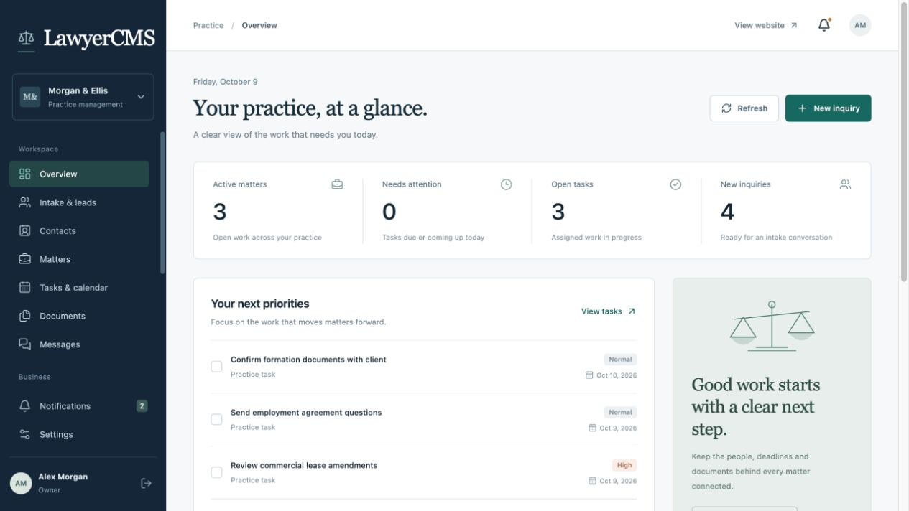
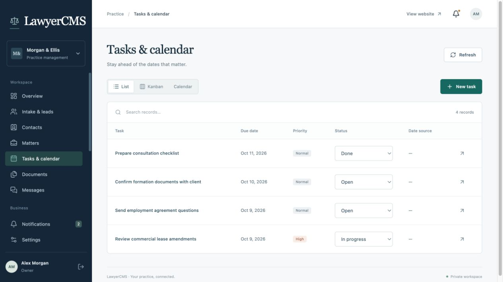
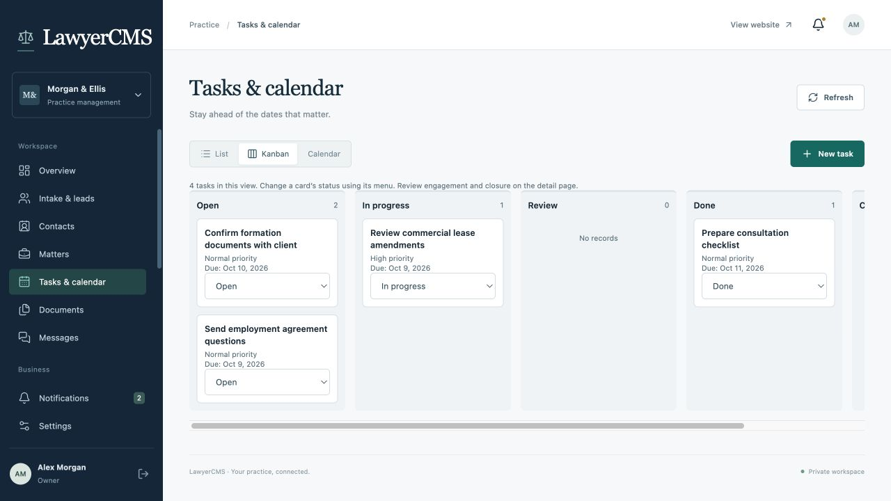
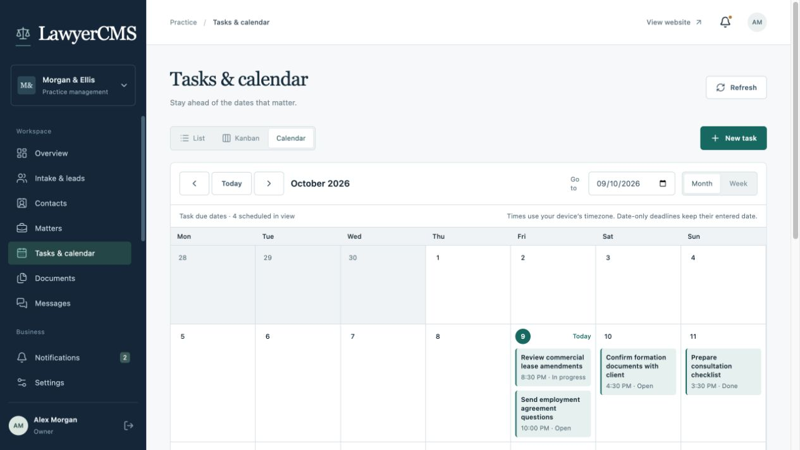
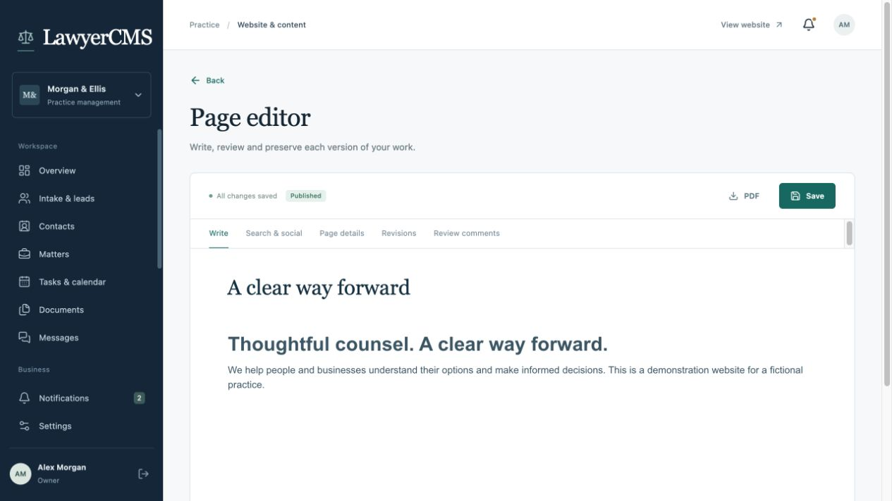
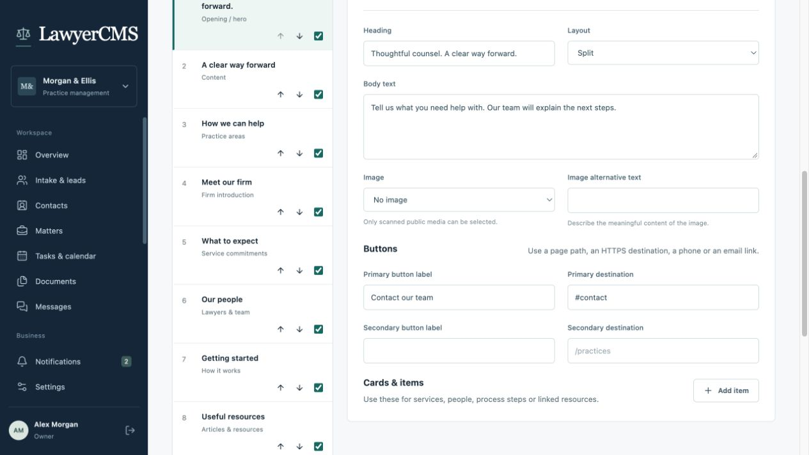
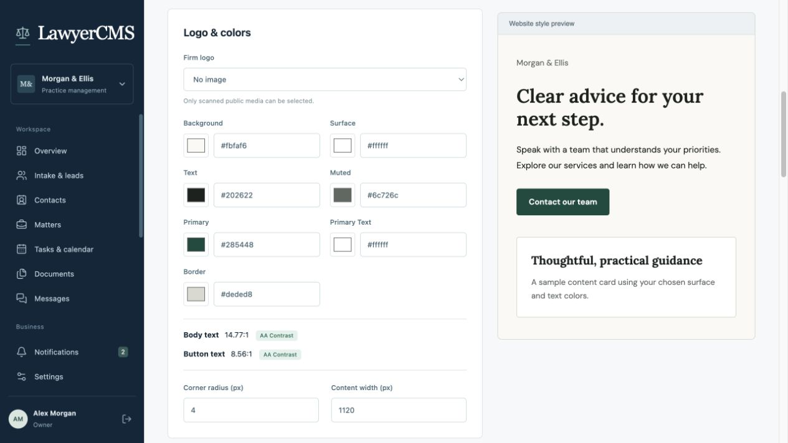
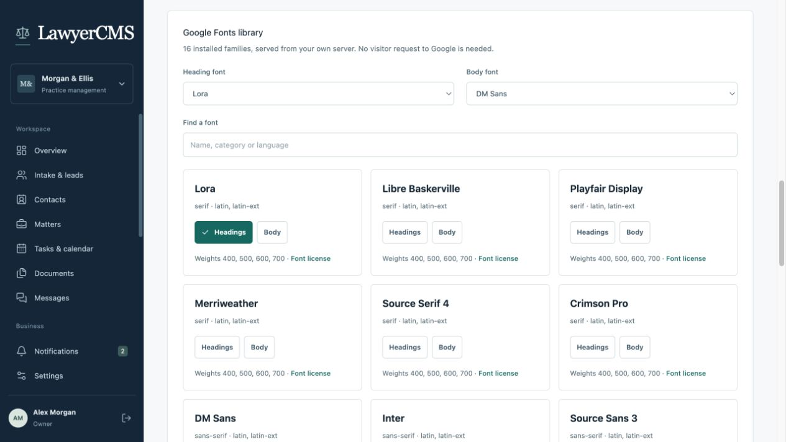

<!-- Author: ramanpal singh | URL: https://kwebby.com -->
# LawyerCMS screenshots

Captured from the running application on 9 October 2026. Morgan & Ellis, its people, matters and tasks are fictional demo data. These are direct application screenshots; they show the current release candidate with no sample records added for the gallery.

[Back to the project overview](../README.md) · [Website guide](WEBSITE_GUIDE.md) · [Theme tutorial](THEME_TUTORIAL.md)

## Practice dashboard

Practice totals, upcoming work and links into the staff workspace.

## Task list and status shortcuts

Update task status directly from the table or open a dedicated detail page.

## Kanban progress

View tasks by status and update cards using their status menus. Wider boards scroll horizontally.

## Calendar

Month and week controls organize scheduled tasks. This view shows the October demo dates.

## BlockNote writing

The dedicated page editor brings writing, search/social metadata, revisions, review comments and exports together.

## Homepage section editor

Reorder or hide sections, edit headings and body text, select a layout and scanned image, and configure button labels and destinations.

## Website colors and preview

Edit color tokens, spacing and corner radius with a style preview and text contrast readings.

## Font library

Choose heading and body fonts from the 16 installed, self-hosted families. Additional Google Fonts catalog installation is configured separately.

## Updating the gallery

Use an isolated fictional demo, capture the relevant page directly from the browser, and keep images under `docs/screenshots/`. Check for credentials, personal records and private files before publishing replacements. Keep captions and the capture date accurate; preserve the application content and branding shown by the browser.
